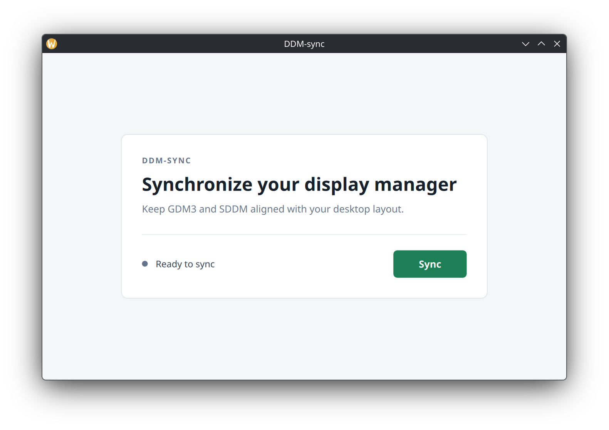

# ddm-sync

Synchronize the display layout used by your Linux desktop with the login screen
of the installed display manager.

[简体中文](README.zh-CN.md)



## Features

- Detects available SDDM, GDM3, and GDM targets automatically.
- Synchronizes only configuration files and display-manager accounts that exist
  on the current system.
- Uses PolicyKit (`pkexec`) only for the privileged copy operation.
- Reports successful, failed, and partially completed synchronization clearly.

## Supported Display Managers

| Display manager | Source | Target |
| --- | --- | --- |
| SDDM | `~/.local/share/kscreen` | `/var/lib/sddm/.local/share/kscreen` |
| GDM3 | `~/.config/monitors.xml` | `/var/lib/gdm3/.config/monitors.xml` |
| GDM | `~/.config/monitors.xml` | `/var/lib/gdm/.config/monitors.xml` |

## Requirements

- Qt/QML runtime libraries required by `qmetaobject`.
- `pkexec` for privileged writes under `/var/lib`.

On Debian or Ubuntu, install the build dependencies with:

```bash
sudo apt-get install pkg-config qtbase5-dev qtdeclarative5-dev \
  qml-module-qtquick2 qml-module-qtquick-controls2
```

## Build and Run

```bash
cargo build --release
./target/release/ddm-sync
```

The repository includes the QML interface in `qml/Main.qml`. When running from
a release archive, keep the `qml` directory beside the `ddm-sync` executable.

## GitHub Actions

Pushes and pull requests build, lint, test, and upload the resulting
Linux `ddm-sync` executable as the `ddm-sync-linux-x86_64` workflow artifact.
Version tags beginning with `v` create a draft GitHub release with the
Linux x86_64 executable attached directly.

## Contributing

Issues and pull requests are welcome. Please keep changes focused, run
`cargo fmt -- --check`, `cargo clippy --locked -- -D warnings`, and
`cargo test --locked` before opening a pull request.

## License

This project is open source under the [MIT License](LICENSE).
